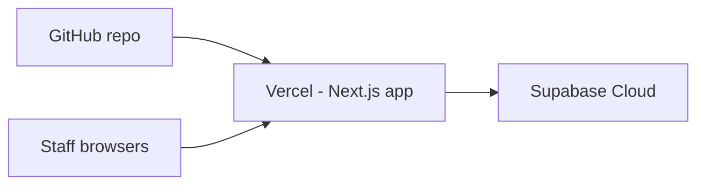

# Deploy BSS Solar Operations Console (Live)

Stack: **Next.js on Vercel** + **Supabase Cloud** (PostgreSQL, Auth, RLS).

Estimated time: ~30 minutes.

---

## Overview



| Layer | Service | Purpose |
| ----- | ------- | ------- |
| Frontend | [Vercel](https://vercel.com) | Hosts the Next.js app |
| Backend | [Supabase](https://supabase.com) | Database, auth, RLS |

---

## Step 1 — Create Supabase project (production database)

1. Go to [supabase.com/dashboard](https://supabase.com/dashboard) → **New project**.
2. Choose a name (e.g. `bss-solar-prod`), region (**South Asia (Mumbai)** is closest to Kerala), and set a strong DB password. Save the password.
3. Wait until the project is **Active**.

### Apply the database schema

**Option A — SQL Editor (simplest)**

1. Open **SQL Editor** → **New query**.
2. Paste the full contents of [`supabase/schema.sql`](supabase/schema.sql) and **Run**.
3. Confirm tables exist under **Table Editor**: `profiles`, `work_orders`, `projects`, `project_milestones`, `service_tickets`.

**Option B — Supabase CLI**

```bash
npx supabase login
npx supabase link --project-ref YOUR_PROJECT_REF
npx supabase db push
```

> Do **not** run `supabase/seed.sql` on production — it is local demo data only.

### Collect API keys

**Project Settings → API**:

| Key | Env variable |
| --- | ------------ |
| Project URL | `NEXT_PUBLIC_SUPABASE_URL` |
| `anon` `public` | `NEXT_PUBLIC_SUPABASE_ANON_KEY` |
| `service_role` `secret` | `SUPABASE_SERVICE_ROLE_KEY` |

Keep the **service role** key secret — server-only (Team → Add Member).

---

## Step 2 — Configure Supabase Auth

1. **Authentication → Providers → Email**  
   - Enable Email provider.  
   - **Disable “Allow new users to sign up”** (staff accounts are created by admin only).

2. **Authentication → URL configuration** (after you have a Vercel URL from Step 3):  
   - **Site URL**: `https://YOUR-APP.vercel.app`  
   - **Redirect URLs**: add  
     - `https://YOUR-APP.vercel.app/**`  
     - `http://localhost:3000/**` (optional, for local testing against prod DB)

3. For faster onboarding, you may disable **Confirm email** under Email provider until staff accounts are set up.

---

## Step 3 — Deploy the Next.js app on Vercel

1. Go to [vercel.com/new](https://vercel.com/new) → **Import** `GSARYAPUTHRAN/bss-solar` from GitHub.
2. Framework preset: **Next.js** (auto-detected).
3. **Environment variables** — add all three:

```
NEXT_PUBLIC_SUPABASE_URL=https://xxxxx.supabase.co
NEXT_PUBLIC_SUPABASE_ANON_KEY=eyJ...
SUPABASE_SERVICE_ROLE_KEY=eyJ...
```

4. Click **Deploy** and wait for the build to finish.
5. Copy your live URL, e.g. `https://bss-solar.vercel.app`.
6. Return to Supabase **URL configuration** (Step 2) and set Site URL + Redirect URLs to this domain.

### Redeploys

Every push to `master` on GitHub can auto-deploy if Vercel Git integration is enabled.

---

## Step 4 — Create the first admin user

There is no public sign-up page. Create the first admin manually:

1. **Supabase → Authentication → Users → Add user**  
   - Email: e.g. `admin@bsssolar.in`  
   - Password: strong password  
   - Check **Auto confirm user**

2. **SQL Editor** — run [`supabase/production-bootstrap.sql`](supabase/production-bootstrap.sql) after editing the email inside the file.

3. Sign in at `https://YOUR-APP.vercel.app/login`.

4. Use **Team → Add Member** to create coordinator accounts.

---

## Step 5 — Smoke test (production)

| Check | How |
| ----- | --- |
| Login | Admin signs in at `/login` |
| Dashboard | Admin sees KPIs at `/` |
| Work order | Coordinator creates one; admin approves |
| Projects board | Cards appear in correct Kanban columns |
| Team | Admin adds a coordinator at `/team/new` |
| PDF | Open a ticket → Download PDF |

---

## Optional — Custom domain

1. **Vercel → Project → Settings → Domains** — add e.g. `ops.bsssolar.com`.
2. Add the DNS records Vercel shows at your domain registrar.
3. Update Supabase **Site URL** and **Redirect URLs** to the custom domain.

---

## Troubleshooting

| Issue | Fix |
| ----- | --- |
| Login redirects loop | Supabase Site URL must match your Vercel URL exactly |
| “Invalid API key” | Re-copy anon key; redeploy Vercel with correct env vars |
| Add Member fails | `SUPABASE_SERVICE_ROLE_KEY` missing or wrong on Vercel |
| Coordinator sees dashboard | Clear cache; ensure latest `master` is deployed |
| RLS blocks data | User must exist in `profiles`; check role is `admin` or `coordinator` |

---

## CLI quick reference

```bash
# Local against production DB (use prod keys in .env.local — be careful)
npm run build          # verify production build
npx supabase db push   # push migration changes to linked project
npx vercel --prod      # deploy from CLI (after vercel login + link)
```
