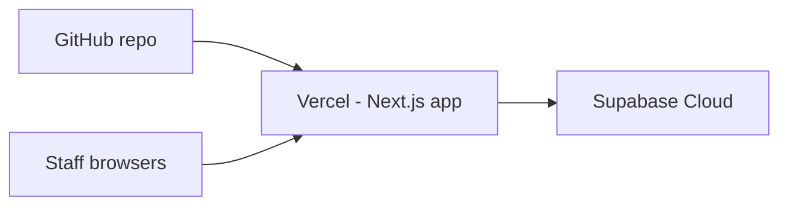

# Deploy BSS Solar Operations Console (Live)

Stack: **Next.js on Vercel** + **Supabase Cloud** (PostgreSQL, Auth, RLS).

Estimated time: ~30 minutes.

---

## Overview



| Layer | Service | Purpose |
| ----- | ------- | ------- |
| Frontend | [Vercel](https://vercel.com) | Hosts the Next.js app |
| Backend | [Supabase](https://supabase.com) | Database, auth, RLS |

---

## Step 1 — Create Supabase project (production database)

1. Go to [supabase.com/dashboard](https://supabase.com/dashboard) → **New project**.
2. Choose a name (e.g. `bss-solar-prod`), region (**South Asia (Mumbai)** is closest to Kerala), and set a strong DB password. Save the password.
3. Wait until the project is **Active**.

### Apply the database schema

**Option A — SQL Editor (simplest)**

1. Open **SQL Editor** → **New query**.
2. Paste the full contents of [`supabase/schema.sql`](supabase/schema.sql) and **Run**.
3. Confirm tables exist under **Table Editor**: `profiles`, `work_orders`, `projects`, `project_milestones`, `service_tickets`.

**Option B — Supabase CLI**

```bash
npx supabase login
npx supabase link --project-ref YOUR_PROJECT_REF
npx supabase db push
```

> Do **not** run `supabase/seed.sql` on production — it is local demo data only.

### Collect API keys

**Project Settings → API**:

| Supabase dashboard label | Vercel env variable |
| ------------------------ | ------------------- |
| **Project URL** | `NEXT_PUBLIC_SUPABASE_URL` |
| **Publishable key** (`sb_publishable_…`) | `NEXT_PUBLIC_SUPABASE_ANON_KEY` |
| **Secret key** (`sb_secret_…`) | `SUPABASE_SERVICE_ROLE_KEY` |

> Older projects may label these `anon` and `service_role` — same mapping applies.

Keep the **secret / service_role** key private — server-only (Team → Add Member).

---

## Step 2 — Configure Supabase Auth

1. **Authentication → Providers → Email**  
   - Enable Email provider.  
   - **Disable “Allow new users to sign up”** (staff accounts are created by admin only).

2. **Authentication → URL configuration**:  
   - **Site URL**: `https://app.bss-solar.com`  
   - **Redirect URLs**: add  
     - `https://app.bss-solar.com/**`  
     - `http://localhost:3000/**` (optional, for local testing against prod DB)

3. For faster onboarding, you may disable **Confirm email** under Email provider until staff accounts are set up.

---

## Step 3 — Deploy the Next.js app on Vercel

1. Go to [vercel.com/new](https://vercel.com/new) → **Import** `GSARYAPUTHRAN/bss-solar` from GitHub.
2. Framework preset: **Next.js** (auto-detected).
3. **Environment variables** (Settings → Environment Variables) — add all three for **Production** (and Preview if you test PRs):

| Name | Value |
| ---- | ----- |
| `NEXT_PUBLIC_SUPABASE_URL` | `https://YOUR-PROJECT-REF.supabase.co` |
| `NEXT_PUBLIC_SUPABASE_ANON_KEY` | your `sb_publishable_…` key |
| `SUPABASE_SERVICE_ROLE_KEY` | your `sb_secret_…` key |

4. Click **Deploy** and wait for the build to finish.
5. Add custom domain **bss-solar.com** under **Settings → Domains** (already done if purchased on Vercel).
6. Return to Supabase **URL configuration** (Step 2):
   - **Site URL**: `https://app.bss-solar.com`
   - **Redirect URLs**: `https://app.bss-solar.com/**`
7. **Redeploy** after adding env vars (Deployments → ⋯ → Redeploy).

### Redeploys

Every push to the **`production`** branch auto-deploys when Vercel is configured to use that branch. Merge `master` into `production` when you are ready to release.

> **Private repo on Hobby:** Git pushes only deploy if the **commit author email** matches your GitHub/Vercel account. If you see *“commit author did not have contributing access”*, fix the email (below) or deploy via CLI.

```powershell
# One-time: use the email on your GitHub account (Settings → Emails)
git config user.email "YOUR-GITHUB-EMAIL"
git config user.name "gsaryaputhran"

# Then commit and push as usual
git checkout production
git merge master
git commit --allow-empty -m "Deploy with correct author"
git push origin production
```

**CLI deploy (bypasses git author check):**

```powershell
npx vercel login
npx vercel link --project bss-solar --yes
npx vercel --prod
```

---

## Step 4 — Create the first admin user

There is no public sign-up page. Create the first admin manually:

1. **Supabase → Authentication → Users → Add user**  
   - Email: e.g. `admin@bsssolar.in`  
   - Password: strong password  
   - Check **Auto confirm user**

2. **SQL Editor** — run [`supabase/production-bootstrap.sql`](supabase/production-bootstrap.sql) after editing the email inside the file.

3. Sign in at `https://app.bss-solar.com/login`.

4. Use **Team → Add Member** to create coordinator accounts.

---

## Step 5 — Smoke test (production)

| Check | How |
| ----- | --- |
| Login | Admin signs in at `/login` |
| Dashboard | Admin sees KPIs at `/` |
| Work order | Coordinator creates one; admin approves |
| Projects board | Cards appear in correct Kanban columns |
| Team | Admin adds a coordinator at `/team/new` |
| PDF | Open a ticket → Download PDF |

---

## Custom domain

Production URL: **https://app.bss-solar.com** (subdomain of `bss-solar.com` registered on Vercel).

Update Supabase **Site URL** and **Redirect URLs** to `https://app.bss-solar.com` only.

## Running costs (typical)

| Service | Tier | Monthly | Notes |
| ------- | ---- | ------- | ----- |
| **Vercel** | Hobby (free) | **$0** | Enough for a small internal ops app |
| **Supabase** | Free | **$0** | 500 MB DB; pauses after ~7 days idle on free tier |
| **Domain** | bss-solar.com | **~$0.94/mo** | ~$11.25/year renewal on Vercel |

**Estimated total today: ~$0/month** + domain renewal (~$11/year).

Upgrade when you outgrow free limits: Supabase Pro **$25/mo**, Vercel Pro **$20/mo** per seat.

---

## Troubleshooting

| Issue | Fix |
| ----- | --- |
| Login redirects loop | Supabase Site URL must match your Vercel URL exactly |
| “Invalid API key” | Re-copy anon key; redeploy Vercel with correct env vars |
| Add Member fails | `SUPABASE_SERVICE_ROLE_KEY` missing or wrong on Vercel |
| Coordinator sees dashboard | Clear cache; ensure latest `master` is deployed |
| Git push blocked on Hobby private repo | Commit email must match GitHub/Vercel account, or use `npx vercel --prod` |
| RLS blocks data | User must exist in `profiles`; check role is `admin` or `coordinator` |

---

## CLI quick reference

```bash
# Local against production DB (use prod keys in .env.local — be careful)
npm run build          # verify production build
npx supabase db push   # push migration changes to linked project
npx vercel --prod      # deploy from CLI (after vercel login + link)
```
